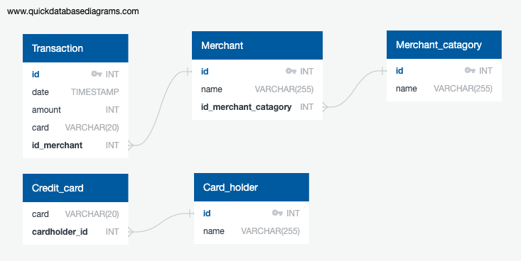
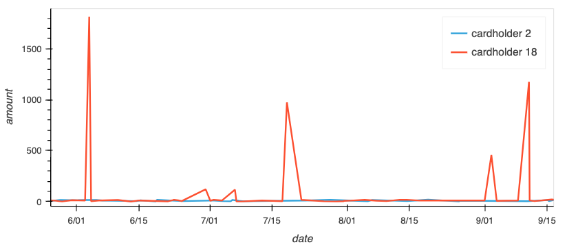
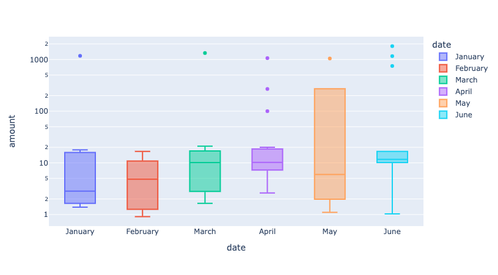

# Fintech--PostgresSQL
postgresSQL has been used in conjuction with python and various packages to assess and visualise fraudulent transaction history. Outlying values among credit card transactions was the main method for detection of fraudlent transactions.

---
## Database schema
A databse schema was used to define the SQL database structure (see below). The web based application [QuickDBD](https://app.quickdatabasediagrams.com/#/) was used to quickly verify and visualise the database structure.

---

## Visual data analysis
hvplot and plotly packages were used to visualise data retrieved from the SQL database. Analysis of fraudulent transactions for a particular credit card was identified by visually observing outliers in the data.

### Data analysis question 1
- What difference do you observe between the consumption patterns of card holder 2 as opposed to card holder 18? Does the difference suggest a fraudulent transaction?

Inspection of the consumption patterns for both card holders (see fig1) indicates that the account of cardholder 18 may be subject to fraudulent activity. It is evident that cardholder 18 has incidents of large transaction values being processed, as opposed to card holder 2 who's transaction value remains along the baseline and is consistent across all time periods.

### Data analysis question 2
- Are there any outliers for cardholder ID 25? How many outliers are there per month?
- Do you notice any anomalies?

The boxplot (see fig3) displays the outlier transactions for cardholder 25 with outliers being outside the interquartile range of the data for a given month. Patterns of interest are the presence of a monthly transaction (excluding February) of approximatly $1100, however, this payment is not precisely the same each month indicating this may not be a recurring payment. The account sees an between 0-3 outlier transactions per month making the month of May a particularly interesting month as the high average transaction value has pushed the boxplot up into a region that would have otherwise been outliers. 

